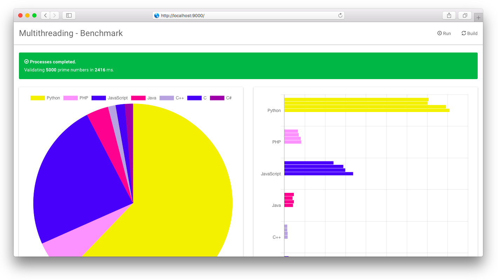

# MultiThreading - Benchmark

This is an example for `Python`, `PHP`, `JavaScript`, `Java`, `C++`, `C` and `C#` multi threading performance test. 
How many prime numbers they can calculate?  
By default only 4 threads running on each process.

Current running environments:
```bash
java -version
# java version "1.8.0_181"
# Java(TM) SE Runtime Environment (build 1.8.0_181-b13)
# Java HotSpot(TM) 64-Bit Server VM (build 25.181-b13, mixed mode

node --version
# v10.15.3

gcc --version
# gcc (Ubuntu 7.3.0-27ubuntu1~18.04) 7.3.0
# Copyright (C) 2017 Free Software Foundation, Inc.
# This is free software; see the source for copying conditions.  There is NO
# warranty; not even for MERCHANTABILITY or FITNESS FOR A PARTICULAR PURPOSE.

g++ --version
# g++ (Ubuntu 7.3.0-27ubuntu1~18.04) 7.3.0
# Copyright (C) 2017 Free Software Foundation, Inc.
# This is free software; see the source for copying conditions.  There is NO
# warranty; not even for MERCHANTABILITY or FITNESS FOR A PARTICULAR PURPOSE.

dotnet --version
# 2.2.203

python --version
# Python 3.6.7

php --version
# PHP 7.2.2 (cli) (built: Apr 19 2019 21:01:08) ( ZTS )
# Copyright (c) 1997-2018 The PHP Group
# Zend Engine v3.2.0, Copyright (c) 1998-2018 Zend Technologies
```

How to build:  
  
```bash
javac -cp . *.java
g++ -I. -pthread -o ThreadCPP.run ThreadCPP.cpp
# for OSX : clang++ --std=c++11 -pthread -I. -o ThreadCPP.run ThreadCPP.cpp
gcc -I. -pthread -o ThreadC.run ThreadC.c
dotnet publish -c Release -o build -v m
```
  
How to run:  
```bash
python ThreadPython.py <total prime numbers>
php ThreadPHP.php <total prime numbers>
node --experimental-worker ThreadJavaScript.js <total prime numbers>
java -cp . ThreadJava <total prime numbers>
./ThreadCPP.run <total prime numbers>
./ThreadC.run <total prime numbers>
dotnet bin/Release/netcoreapp2.2/ThreadCS.dll -- <total prime numbers>
```
  
Example input:    
```bash
python ThreadPython.py 100000
php ThreadPHP.php 100000
node --experimental-worker ThreadJavaScript.js 100000
java -cp . ThreadJava 100000
./ThreadCPP.run 100000
./ThreadC.run 100000
dotnet bin/Release/netcoreapp2.2/ThreadCS.dll -- 100000
```
  
Example output:  
```
Language thread id #1: executes 100000 prime numbers in 280 ms
Language thread id #2: executes 100000 prime numbers in 280 ms
Language thread id #4: executes 100000 prime numbers in 287 ms
Language thread id #3: executes 100000 prime numbers in 283 ms
```
# Preview result in web browser

You can preview result in web browser. Visualized with [Chart.js](https://www.chartjs.org) 

```bash
DEBUG=true REBUILD=true PORT=9000 node run.js 100000
```

open your browser and go to [http://localhost:9000/](http://localhost:9000/)



# Run with Docker

Simple run with docker:

```bash
docker build -t multithreading-benchmark --rm --force-rm .
docker run --name thread -p 9000:9000 -d multithreading-benchmark
docker-exec  -it thread run.sh -p all -n 100000
docker-exec  -it thread run.sh --help
```

or with `docker-compose`
```bash
docker-compose up -d
docker-compose exec thread run.sh -p all -n 100000
docker-compose exec thread run.sh --help
```

# License MIT

Copyright 2019 MultiThreading - Benchmark

Permission is hereby granted, free of charge, to any person obtaining a copy of this software and associated documentation files (the "Software"), to deal in the Software without restriction, including without limitation the rights to use, copy, modify, merge, publish, distribute, sublicense, and/or sell copies of the Software, and to permit persons to whom the Software is furnished to do so, subject to the following conditions:

The above copyright notice and this permission notice shall be included in all copies or substantial portions of the Software.

THE SOFTWARE IS PROVIDED "AS IS", WITHOUT WARRANTY OF ANY KIND, EXPRESS OR IMPLIED, INCLUDING BUT NOT LIMITED TO THE WARRANTIES OF MERCHANTABILITY, FITNESS FOR A PARTICULAR PURPOSE AND NONINFRINGEMENT. IN NO EVENT SHALL THE AUTHORS OR COPYRIGHT HOLDERS BE LIABLE FOR ANY CLAIM, DAMAGES OR OTHER LIABILITY, WHETHER IN AN ACTION OF CONTRACT, TORT OR OTHERWISE, ARISING FROM, OUT OF OR IN CONNECTION WITH THE SOFTWARE OR THE USE OR OTHER DEALINGS IN THE SOFTWARE.